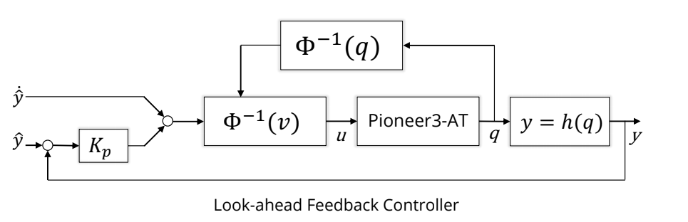

# Look-ahead control

Look-ahead control is feedback controller for nonholonomic mobile robot systems. The 
mobile robot follows a predefined point a set distance from the center of the robot.
The look-ahead controller is designed by using input-output linearization and nonholonomic 
constraint equations.

## Subscribed Topics
-  `odometry` ([nav_msgs/Odometry](http://docs.ros.org/api/nav_msgs/html/msg/Odometry.html))
-  `point_desired` ([geometry_msgs/PoseStamped](http://docs.ros.org/api/geometry_msgs/html/msg/PoseStamped.html)) - 
  We want to use this eventually along with a path planner

## Published Topics
- [ ] `cmd_vel` ([geometry_msgs/Twist](http://docs.ros.org/api/geometry_msgs/html/msg/Twist.html))  

## ROS Parameters
- [x] `lookahead_distance_x` (double, default: 0.5 meters) - define distance with respect to mobile robot
- [x] `lookahead_distance_y` (double, default: 0.0 meters) - define distance with respect to mobile robot
- [x] `robot_rot_vel` (double, default: 140 rad/s) - maximum angular speed of the robot
- [x] `gains_kp_1` (double, default: 0.3)
- [x] `gains_kp_2` (double, default: 0.3)
- [x] `distance_margin` (double, default: 0.1)

